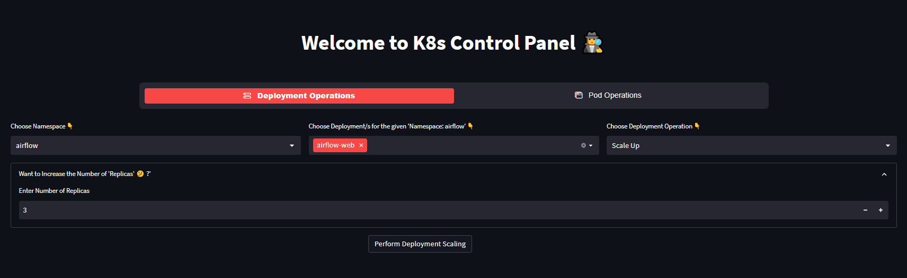
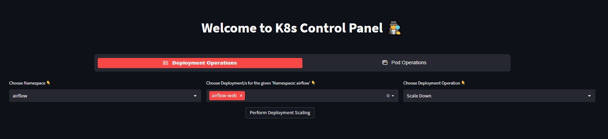
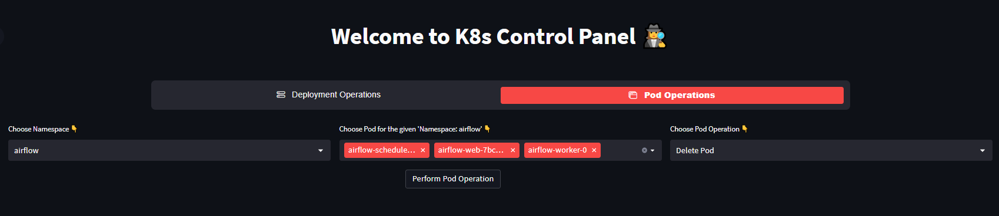

<h1>K8s Control Panel :hammer_and_wrench:</h1>

> <b> Fun Fact : -</b> The name "Kubernetes" originates from Greek, meaning "helmsman" or "pilot." It is an apt metaphor as Kubernetes acts as the orchestrator or captain of containerized applications, steering and managing their deployment, scaling, and operations in a distributed system.

<b>
Greetings, Devs() :wave: If you're weary of utilizing the 'kubectl' command, why not explore an alternative approach to handling your 'Kubernetes' applications? Give 'K8s Control Panel' a try! It's an application built using the 'Kubernetes + Streamlit Framework' of the Python programming language.
</b>

<hr/>

## Application Setup Guidelines :bookmark_tabs:

1. <b>Dependency Installations </b> 
    - Make an virtual enviorment and install all the necessary components to run the 'Application'

    ```
    virtualenv venv
    ```

    - Activate your virtual enviorment

    ```
    - For MacOS:
        source venv/bin/activate

    - For Windows:
        venv\Scripts\activate.bat
    ```

    - Install all the necessary ingredients from `requirements.txt` file:

    ```
    pip3 install -r requirements.txt
    ```

> To Learn More About `virtualenv`: [Click Here](https://docs.python.org/3/tutorial/venv.html)

2. <b>Generation and Integration of 'KubeConfig' File </b>
    <details>
        <summary><b>Expand me :point_down:, For the steps to create your own 'kubeconfig'</b></summary>
        <ol>
            <li>
                <b>For Elastic Kubernetes Service (EKS) of Amazon Web Services (AWS)</b>
                <ul>
                    <li>
                        Install the <code>AWS CLI</code> if you haven't already and Configure your AWS credentials using: <code>aws configure</code>
                    </li>
                    <li>
                        Install the AWS IAM Authenticator if you haven't already
                    </li>
                    <li>
                        Generate the kubeconfig file using: <code>aws eks update-kubeconfig --name 'cluster_name' --region 'region_name'</code> command
                    </li>
                </ul>
            </li>
            <li>
                <b>For Google Cloud Platform (GCP)</b>
                <ul>
                    <li>
                        Install the <code>Google Cloud SDK (gcloud)</code> if you haven't already and Log in to GCP using the <code>gcloud auth login</code> command
                    </li>
                    <li>
                        Set the desired project if you have multiple projects: <code>gcloud config set project 'project_id'</code>
                    </li>
                    <li>
                        Generate the kubeconfig file using <code>gcloud container clusters get-credentials 'cluster_name' --zone 'zone_name'</code> command
                    </li>
                </ul>
            </li>
            <li>
                <b>For Microsoft Azure:</b>
                <ul>
                    <li>
                        Install the <code>Azure CLI</code> if you haven't already and Log in to Azure using <code>az login</code> command
                    </li>
                    <li>
                        Set the desired subscription if you have multiple subscriptions: <code>az account set --subscription 'subscription_id'</code>
                    </li>
                    <li>
                        Generate the kubeconfig file using <code>az aks get-credentials --resource-group 'resource_group_name' --name 'cluster_name'</code> command
                    </li>
                </ul>
            </li>
        </ol>

    > <b>Note: - Make sure you have the necessary permissions and access to the respective cloud providers before generating the 'kubeconfig' files. Replace 'resource_group_name', 'cluster_name', 'subscription_id', 'project_id', 'zone_name', and 'region_name' with the appropriate values for your environment </b>
    </details>

    <details>
        <summary>
            <b>Got my 'KubeConfig' what next :thinking:? </b>
        </summary>

    <ul>
        <li>
            Get your 'kubeconfig' file and replace it with explanatory 'k8sconfig.txt' at <code>config\k8sconfig.txt</code>
        </li>
    </ul>

    > <b>Note: Please avoid using the 'k8sconfig.txt' file mentioned in the source code as it was merely an illustrative file provided for reference. Also, kindly adhere to the prescribed naming convention for the filest</b>
    </details>

3. <b>Setting up a user and generating a ~~password~~ (****) </b>
<ul>
    <li>
        <b>
            Open <code>config\config.json</code> file and set <code>decrypted_password_jay_user: password_of_your_choice</code> and <code>password_hashing_flag: True</code> to generate new encrypted password <br/>
            &nbsp; - You can change <code>decrypted_password_jay_user</code> variable with your choice of variable to but don't forget to replace the variable in <code>main_application.py</code> file :smile:
        </br>
    </li>
    <li>
        <b>
            Run Main Application to generated <code>hashed_password</code> by running <code>python3 -m streamlit run main_application.py</code> <br/>
            &nbsp; - This command will boot up an application, but still you won't be able to access it because we need proper 'Authenticated Credentials' <br/>
            &nbsp; - After booting up an application <code>hashed_password</code> will be logged into your <code>terminal</code>
        </br>
    </li>
    <li>
        <b>
            Copy the <code>hashed_password</code> generated from above step and paste it of <code>password</code> variable into <code>config\credential.yaml</code> and don't forget to enter your <code>name</code> and <code>email</code> too.
        </b>
    </li>
    <li>
        <b>
            Now, after setting up all the credentials. Make <code>password_hashing_flag: False</code> in <code>config\config.json</code> file because we have to generate password one time only
        </b>
    </li>
</ul>

4. <b>After completion of all the steps mentioned above. You're ready to launch your application :rocket:</b>. To launch your application run the command mentioned below captain :man_pilot: :

&nbsp; &nbsp; &nbsp;<code>python3 -m streamlit run main_application.py</code>

<hr/>

### :dizzy: Some Glimpse of Application :sunglasses:

### 1. Deployment Scalling Up


### 2. Deployment Scalling Down


### 3. Pod Deletion Operation


<hr/>

#### To Contribute to the Project:

1. Choose any open issue from [here](https://github.com/jaypatel15406/K8s-Control-Panel-Using-Streamlit/issues). 
2. Comment on the Issue: `Can I work on this?` and Start Exploring it.
3. Make changes to your Fork and Send a PR.

#### To Create a PR (Pull Request):

For Creating Valid PR Successfully. Kindly follow Guide: https://help.github.com/articles/creating-a-pull-request/

#### To Send a PR, Follow Rules Carefully !!   

**Otherwise your PR will be Closed**:

1. For Appropriate PR, follow Title Format: `Fixes #IssueNo : Name of the Issue`

For any Doubts related to the Issues, such as understanding Issue better etc., Comment Down your Queries on the Respective Issue.
