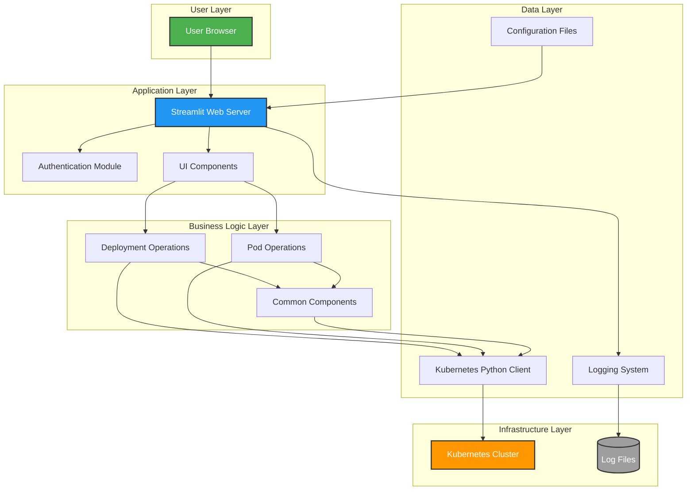
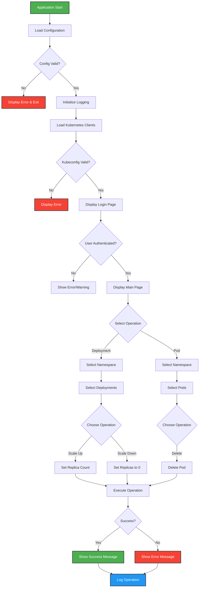

# K8s Control Panel

A Streamlit-based web interface for managing Kubernetes deployments and pods without requiring direct kubectl command usage.

## Abstract

The K8s Control Panel is a Python web application that provides an intuitive graphical interface for common Kubernetes operations. Built with Streamlit and the Kubernetes Python client, it enables developers and operators to manage deployments and pods through a browser-based interface, eliminating the need for command-line kubectl operations.

Key capabilities include:
- User authentication and authorization
- Namespace-scoped operations
- Deployment scaling (up/down)
- Pod management (deletion, resource updates)
- Real-time operation feedback
- Comprehensive logging and error handling

---

## 🎥 Video Demo

Watch a quick demo of the K8s Control Panel in action (click below for full video 👇):

<div style="text-align: center; margin: 20px 0;">
    <a href="https://www.loom.com/share/c00d110253434a2088b4f33dd7402e9d">
        
    </a>
</div>

---

## Project Architecture

### System Architecture Diagram


```mermaid
flowchart TB
    subgraph User Layer
        A[User Browser]
    end
    
    subgraph Application Layer
        B[Streamlit Web Server]
        C[Authentication Module]
        D[UI Components]
    end
    
    subgraph Business Logic Layer
        E[Deployment Operations]
        F[Pod Operations]
        G[Common Components]
    end
    
    subgraph Data Layer
        H[Kubernetes Python Client]
        I[Configuration Files]
        J[Logging System]
    end
    
    subgraph Infrastructure Layer
        K[Kubernetes Cluster]
        L[(Log Files)]
    end
    
    A --> B
    B --> C
    B --> D
    D --> E
    D --> F
    E --> G
    F --> G
    E --> H
    F --> H
    G --> H
    H --> K
    I --> B
    J --> L
    B --> J
    
    style A fill:#4CAF50,stroke:#333,stroke-width:2px,color:#fff
    style B fill:#2196F3,stroke:#333,stroke-width:2px,color:#fff
    style K fill:#FF9800,stroke:#333,stroke-width:2px,color:#fff
    style L fill:#9E9E9E,stroke:#333,stroke-width:2px,color:#fff
```

### Technical Flow Diagram


```mermaid
flowchart TD
    A[Application Start] --> B[Load Configuration]
    B --> C{Config Valid?}
    C -->|No| D[Display Error & Exit]
    C -->|Yes| E[Initialize Logging]
    E --> F[Load Kubernetes Clients]
    F --> G{Kubeconfig Valid?}
    G -->|No| H[Display Error]
    G -->|Yes| I[Display Login Page]
    I --> J{User Authenticated?}
    J -->|No| K[Show Error/Warning]
    J -->|Yes| L[Display Main Page]
    L --> M{Select Operation}
    M -->|Deployment| N[Select Namespace]
    M -->|Pod| O[Select Namespace]
    N --> P[Select Deployments]
    O --> Q[Select Pods]
    P --> R{Choose Operation}
    Q --> S{Choose Operation}
    R -->|Scale Up| T[Set Replica Count]
    R -->|Scale Down| U[Set Replicas to 0]
    S -->|Delete| V[Delete Pod]
    T --> X[Execute Operation]
    U --> X
    V --> X
    X --> Y{Success?}
    Y -->|Yes| Z[Show Success Message]
    Y -->|No| AA[Show Error Message]
    Z --> AB[Log Operation]
    AA --> AB
    
    style A fill:#4CAF50,stroke:#333,stroke-width:2px,color:#fff
    style D fill:#f44336,stroke:#333,stroke-width:2px,color:#fff
    style H fill:#f44336,stroke:#333,stroke-width:2px,color:#fff
    style Z fill:#4CAF50,stroke:#333,stroke-width:2px,color:#fff
    style AA fill:#f44336,stroke:#333,stroke-width:2px,color:#fff
    style AB fill:#2196F3,stroke:#333,stroke-width:2px,color:#fff
```

---

## File Architecture

### Directory Structure

```
K8s-Control-Panel-Using-Streamlit/
├── main_application.py          # Application entry point: Streamlit app orchestration
├── requirements.txt             # Python dependencies with version constraints
├── README.md                    # Project documentation
├── LICENSE                      # MIT License
├── .gitignore                   # Git ignore rules
│
├── config/
│   ├── config.json              # Application settings: loader, logging, image configs
│   ├── credential.yaml          # User authentication credentials (hashed passwords)
│   └── k8sconfig.txt            # Kubernetes kubeconfig file (cluster connection)
│
├── common/
│   ├── common_component.py      # Reusable UI components: namespace selector
│   ├── logging_config.py        # Logging configuration: file rotation, formatters
│   └── __pycache__/             # Python bytecode cache
│
├── scripts/
│   ├── deployment_page.py       # Deployment operations: scaling up/down
│   ├── pod_page.py              # Pod operations: deletion, resource updates
│   └── __pycache__/             # Python bytecode cache
│
├── template/
│   └── watermark_removal/
│       └── watermark_removal_script.html  # Streamlit watermark removal CSS
│
├── media/
│   ├── K8s_Control_Panel_Logo.png         # Application logo
│   ├── Coming_Soon_Image.png              # Placeholder for upcoming features
│   ├── Deployment_Scaling_Up_Image.PNG    # Screenshot: scaling up
│   ├── Deployment_Scaling_Down_Image.PNG  # Screenshot: scaling down
│   └── Pod_Deletion_Operation_Image.PNG   # Screenshot: pod deletion
│
└── logs/
    └── app.log                    # Application log file (auto-created)
```

---

## Prerequisites

### System Requirements

| Component | Version | Description |
|-----------|---------|-------------|
| Python | 3.10 - 3.13 | Required runtime environment |
| pip | 22.0+ | Python package installer |
| Kubernetes Cluster | 1.28+ | Target cluster for operations |
| kubectl | 1.28+ | For kubeconfig generation |
| Git | 2.30+ | For cloning the repository |

### Cloud Provider CLI Tools (Optional)

Install based on your Kubernetes provider:

| Provider | CLI Tool | Purpose |
|----------|----------|---------|
| AWS EKS | AWS CLI + IAM Authenticator | Generate kubeconfig |
| GCP GKE | Google Cloud SDK (gcloud) | Generate kubeconfig |
| Azure AKS | Azure CLI | Generate kubeconfig |
| Local | kind/minikube | Local cluster testing |

---

## Installation

### Step 1: Clone the Repository

```bash
git clone https://github.com/jaypatel15406/K8s-Control-Panel-Using-Streamlit.git
cd K8s-Control-Panel-Using-Streamlit
```

### Step 2: Create and Activate Virtual Environment

**macOS/Linux:**
```bash
python3 -m venv venv
source venv/bin/activate
```

**Windows (Command Prompt):**
```bash
python -m venv venv
venv\Scripts\activate.bat
```

**Windows (PowerShell):**
```bash
python -m venv venv
venv\Scripts\Activate.ps1
```

### Step 3: Install Dependencies

```bash
pip install -r requirements.txt
```

---

## Configuration

### Step 1: Generate Kubernetes Kubeconfig

#### For Amazon EKS (AWS)

```bash
# Install AWS CLI and configure credentials
aws configure

# Install AWS IAM Authenticator (if not already installed)

# Generate kubeconfig
aws eks update-kubeconfig --name <cluster_name> --region <region_name>
```

#### For Google GKE (GCP)

```bash
# Install Google Cloud SDK and authenticate
gcloud auth login

# Set project (if multiple)
gcloud config set project <project_id>

# Generate kubeconfig
gcloud container clusters get-credentials <cluster_name> --zone <zone_name>
```

#### For Azure AKS

```bash
# Install Azure CLI and authenticate
az login

# Set subscription (if multiple)
az account set --subscription <subscription_id>

# Generate kubeconfig
az aks get-credentials --resource-group <resource_group_name> --name <cluster_name>
```

**Note:** Replace placeholder values (`<cluster_name>`, `<region_name>`, etc.) with your actual cluster details.

---

### 🐳 Step 2 (Optional): Test with Local Kubernetes Cluster

**Don't have a Kubernetes cluster?** No problem! Use the included Docker-based K3s cluster for safe testing without connecting to a production cluster. This is **highly recommended** for development and testing.

#### Why Use the Docker K8s Test Environment?

| Benefit | Description |
|---------|-------------|
| 🚀 **Quick Setup** | Start a local K8s cluster in under 2 minutes |
| 🔒 **Safe Testing** | No risk to production resources |
| 💰 **No Cloud Account Needed** | Test without AWS, GCP, or Azure |
| 📦 **Pre-configured Resources** | Test deployments and pods included |
| 🎯 **Isolated Environment** | Docker-based K3s cluster |
| 🧪 **Perfect for Development** | Test features before production deployment |

#### Quick Start

```bash
# Navigate to test environment (at project root)
cd docker-k8s-test

# Start the local K8s cluster
docker-compose up -d

# Wait for cluster to be ready (30-60 seconds)
docker-compose logs -f k8s-cluster

# Extract kubeconfig automatically (copies to config/k8sconfig.txt)
docker-compose run kubeconfig-extractor
```

The kubeconfig is automatically:
- ✅ Extracted from the cluster
- ✅ Copied to `config/k8sconfig.txt`
- ✅ Server URL set to `https://localhost:6443`
- ✅ Certificates embedded inline (no file dependencies)

#### Pre-Created Test Resources

The test environment includes ready-to-use resources:

**Namespace:**
- `k8s-control-panel-test` - Isolated test namespace

**Deployments:**

| Name | Initial Replicas | Image | Description |
|------|-----------------|-------|-------------|
| `test-nginx-deployment` | 2 | nginx:1.25-alpine | Web server for scaling tests |
| `test-busybox-deployment` | 1 | busybox:1.36 | Lightweight container for testing |

**Pods (Standalone):**

| Name | Image | Purpose |
|------|-------|---------|
| `test-nginx-pod` | nginx:1.25-alpine | Test pod deletion |
| `test-busybox-pod` | busybox:1.36 | Test pod deletion |

#### Testing the Application

1. **Start the Application:**
   ```bash
   python -m streamlit run main_application.py
   ```

2. **Test Deployment Operations:**
   - Select **"Deployment Operations"** tab
   - Choose namespace: `k8s-control-panel-test`
   - Select deployments and perform scaling

3. **Test Pod Operations:**
   - Select **"Pod Operations"** tab
   - Choose namespace: `k8s-control-panel-test`
   - Select pods and delete them

#### Essential kubectl Commands

```bash
# List all namespaces
kubectl --kubeconfig=../config/k8sconfig.txt get namespaces

# List pods in test namespace
kubectl --kubeconfig=../config/k8sconfig.txt get pods -n k8s-control-panel-test

# Scale deployment
kubectl --kubeconfig=../config/k8sconfig.txt scale deployment test-nginx-deployment --replicas=5 -n k8s-control-panel-test
```

#### Resource Usage

| Resource | Approximate Usage |
|----------|------------------|
| CPU | 500MB - 1GB |
| Memory | 1GB - 2GB |
| Disk | 500MB |

#### 📖 Complete Documentation

For detailed instructions, all kubectl commands, troubleshooting, and advanced usage, see:

**→ [Docker K8s Test Environment - Complete Guide](docker-k8s-test/README.md)**

---

### Step 3: Configure Kubeconfig File

Copy your kubeconfig file to the application:

```bash
# Locate your kubeconfig (default: ~/.kube/config)
cp ~/.kube/config config/k8sconfig.txt
```

**Important:** The file must be named `k8sconfig.txt` and placed in the `config/` directory.

### Step 4: Set Up User Authentication

1. **Edit `config/config.json`:**

   Set your initial password and enable password hashing:

   ```json
   {
       "decrypted_password_jay_user": "your_secure_password",
       "password_hashing_flag": "True"
   }
   ```

2. **Run the application to generate hashed password:**

   ```bash
   python -m streamlit run main_application.py
   ```

   The application will log the hashed password to the terminal:

   ```
   Paste this password into 'config/credential.yaml' File and change the
   'password_hashing_flag' in 'config/config.json' File to 'False':
   ['$2b$12$...']
   ```

3. **Update `config/credential.yaml`:**

   Replace the password hash and update user details. Note: The `preauthorized`
   section is optional in streamlit-authenticator >= 0.4.0:

   ```yaml
   credentials:
     usernames:
       your_username:
         email: your.email@example.com
         name: Your Name
         password: '$2b$12$...'  # Paste hashed password here
   cookie:
     expiry_days: 0
     key: 'K8s Control Panel Cookie Key'
     name: 'K8s Control Panel Cookie'
   ```

4. **Disable password hashing:**

   Edit `config/config.json` and set:

   ```json
   {
       "password_hashing_flag": "False"
   }
   ```

### Step 4: Configuration Reference

#### config.json Settings

| Setting | Default | Description |
|---------|---------|-------------|
| `decrypted_password_jay_user` | - | Plain text password for initial hashing |
| `password_hashing_flag` | "False" | Enable to generate new password hash |
| `logging_configurations.level` | "INFO" | Log level (DEBUG/INFO/WARNING/ERROR) |
| `logging_configurations.file` | "logs/app.log" | Log file path |
| `logging_configurations.max_bytes` | 5242880 | Max log file size before rotation (5MB) |
| `logging_configurations.backup_count` | 3 | Number of backup log files to retain |
| `logging_configurations.format` | - | Log message format string |

#### credential.yaml Settings

| Setting | Description |
|---------|-------------|
| `credentials.usernames` | Dictionary of authorized users |
| `credentials.usernames.<username>.email` | User email address |
| `credentials.usernames.<username>.name` | Display name |
| `credentials.usernames.<username>.password` | Bcrypt hashed password |
| `cookie.expiry_days` | Cookie validity period (0 = session only) |
| `cookie.key` | Encryption key for cookie |
| `cookie.name` | Cookie name identifier |
| `preauthorized.emails` | Emails allowed to register |

---

## Running the Application

### Start the Application

```bash
python -m streamlit run main_application.py
```

The application will open in your default web browser at `http://localhost:8501`.

### Expected Output

```
  You can now view your Streamlit app in your browser.

  Local URL: http://localhost:8501
  Network URL: http://<your-ip>:8501
```

### Application Workflow

1. **Login Page:** Enter your username and password
2. **Main Page:** Select operation type from horizontal menu
3. **Kubernetes Configuration Check:**
   - If kubeconfig is configured: Dropdowns populate with namespaces, deployments, and pods
   - If kubeconfig is missing: Info messages appear explaining Kubernetes is not configured (UI still loads)
4. **Deployment Operations:**
   - Choose namespace (or see info message if not configured)
   - Select deployments (multi-select)
   - Choose operation (Scale Up / Scale Down)
   - Set replica count (for scale up)
   - Execute scaling
5. **Pod Operations:**
   - Choose namespace (or see info message if not configured)
   - Select pod(s)
   - Choose operation: **Delete Pod**
   - Execute operation

**Note:** The application gracefully handles missing Kubernetes configuration by showing informative messages while keeping the UI functional.

---

## Features

### Deployment Operations

| Operation | Description | Use Case |
|-----------|-------------|----------|
| Scale Up | Increase replica count (1-10) | Handle increased load |
| Scale Down | Reduce replicas to zero | Save resources during low traffic |

### Pod Operations

| Operation | Description | Use Case |
|-----------|-------------|----------|
| Delete Pod | Remove selected pod(s) | Restart failed pods, cleanup |

### Security Features

- Bcrypt password hashing
- Cookie-based session management
- Pre-authorized email validation
- Namespace-scoped operations (prevents accidental cluster-wide changes)

---

## Troubleshooting

### Common Issues

#### 1. Application Loads with Warnings

**Symptom:** Application shows "Kubernetes not configured" warning and dropdowns are empty

**Solution:** This is expected behavior when kubeconfig is not configured. The application will still load the UI.
```bash
# Add your kubeconfig file
cp ~/.kube/config config/k8sconfig.txt

# Or regenerate kubeconfig using your cloud provider CLI
```

#### 2. "Config file not found" Error

**Symptom:** Application shows credential file error message

**Solution:**
```bash
# Verify config files exist
ls -la config/

# Expected files:
# - config.json (application settings)
# - credential.yaml (user credentials)
# - k8sconfig.txt (Kubernetes configuration - optional for UI to load)
```

#### 3. "Kubeconfig invalid" Error

**Symptom:** Warning message about invalid kubeconfig

**Solution:**
```bash
# Test kubeconfig with kubectl
kubectl --kubeconfig=config/k8sconfig.txt get namespaces

# If this fails, regenerate kubeconfig using cloud provider CLI
```

#### 4. "Authentication failed" Error

**Symptom:** Cannot log in with credentials

**Solution:**
1. Verify `credential.yaml` password hash is correctly formatted
2. Ensure `password_hashing_flag` is set to `"False"` after initial setup
3. Check username matches exactly (case-sensitive)

#### 5. "No namespaces available" Error

**Symptom:** Namespace dropdown shows info message but no options

**Solution:**
- This is normal if Kubernetes is not configured - the app shows an info message
- Verify cluster connection: `kubectl cluster-info`
- Check user has RBAC permissions to list namespaces
- Ensure kubeconfig context is set correctly

#### 5. Logging Not Working

**Symptom:** No log files created in `logs/` directory

**Solution:**
```bash
# Check directory permissions
mkdir -p logs
chmod 755 logs

# Verify logging configuration in config.json
```

#### 6. "Module not found" Error

**Symptom:** ImportError for streamlit, kubernetes, etc.

**Solution:**
```bash
# Ensure virtual environment is activated
# Reinstall dependencies
pip install -r requirements.txt --upgrade
```

### Log File Analysis

View application logs:

```bash
# Real-time log monitoring
tail -f logs/app.log

# Search for errors
grep "ERROR" logs/app.log

# View recent logs
cat logs/app.log | tail -50
```

---

## Development

### Code Structure

The application follows a modular architecture:

```
main_application.py          # Entry point, authentication, routing
├── common/
│   ├── common_component.py  # Shared UI components
│   └── logging_config.py    # Logging setup
└── scripts/
    ├── deployment_page.py   # Deployment operations
    └── pod_page.py          # Pod operations
```

### Adding New Features

1. **Create new operation page:**
   - Add file in `scripts/` directory
   - Implement page function with `v1` and `a1` parameters
   - Add navigation in `main_application.py`

2. **Add common components:**
   - Extend `CommonComponent` class in `common/common_component.py`
   - Document with Google-style docstrings

3. **Update configuration:**
   - Add settings to `config/config.json`
   - Document in README.md Configuration Reference

### Code Style

- **Type Hints:** All functions use Python 3.10+ type hints
- **Docstrings:** Google-style docstrings for all public functions
- **Logging:** Comprehensive logging at INFO and ERROR levels
- **Error Handling:** Try-except blocks with user-friendly messages

---

## Contributing

### How to Contribute

1. **Find an Issue:**
   Browse [open issues](https://github.com/jaypatel15406/K8s-Control-Panel-Using-Streamlit/issues)

2. **Claim an Issue:**
   Comment: "Can I work on this?" on the issue

3. **Fork and Clone:**
   ```bash
   git clone https://github.com/YOUR_USERNAME/K8s-Control-Panel-Using-Streamlit.git
   cd K8s-Control-Panel-Using-Streamlit
   ```

4. **Create a Branch:**
   ```bash
   git checkout -b feature/issue-123-short-description
   ```

5. **Make Changes:**
   - Follow existing code style
   - Add type hints and docstrings
   - Test thoroughly

6. **Commit and Push:**
   ```bash
   git add .
   git commit -m "Fixes #123: Brief description of changes"
   git push origin feature/issue-123-short-description
   ```

7. **Create Pull Request:**
   - Title format: `Fixes #123: Issue Title`
   - Include description of changes
   - Reference related issues

### Pull Request Guidelines

- **Title:** `Fixes #IssueNo: Description`
- **Description:** Explain what changes were made and why
- **Tests:** Verify functionality manually
- **Documentation:** Update README if adding features
- **Code Style:** Follow PEP 8 and project conventions

---

## Security Considerations

### Best Practices

1. **Kubeconfig Security:**
   - Never commit `k8sconfig.txt` to version control
   - Use service accounts with minimal RBAC permissions
   - Rotate credentials regularly

2. **Password Management:**
   - Use strong, unique passwords
   - Store password hashes securely
   - Enable `password_hashing_flag` only during initial setup

3. **Network Security:**
   - Run application behind firewall for production use
   - Use HTTPS in production (configure Streamlit server)
   - Restrict access to trusted IPs

4. **Logging:**
   - Review logs regularly for suspicious activity
   - Implement log rotation (configured by default)
   - Avoid logging sensitive information

### RBAC Recommendations

Create a dedicated service account with minimal permissions:

```yaml
apiVersion: v1
kind: ServiceAccount
metadata:
  name: k8s-control-panel
  namespace: default
---
apiVersion: rbac.authorization.k8s.io/v1
kind: Role
metadata:
  name: k8s-control-panel-role
  namespace: default
rules:
- apiGroups: [""]
  resources: ["pods", "namespaces"]
  verbs: ["get", "list", "delete"]
- apiGroups: ["apps"]
  resources: ["deployments"]
  verbs: ["get", "list", "patch"]
---
apiVersion: rbac.authorization.k8s.io/v1
kind: RoleBinding
metadata:
  name: k8s-control-panel-binding
  namespace: default
subjects:
- kind: ServiceAccount
  name: k8s-control-panel
roleRef:
  kind: Role
  name: k8s-control-panel-role
  apiGroup: rbac.authorization.k8s.io
```

---

## Future Enhancements

Planned features for upcoming releases:

1. **Pod Resource Management:**
   - Update CPU limits
   - Update memory limits
   - Resource quota visualization

2. **Additional Operations:**
   - Service management
   - ConfigMap editing
   - Secret management
   - Ingress configuration

3. **Monitoring Integration:**
   - Real-time pod metrics
   - Deployment history
   - Resource utilization charts

4. **Multi-Cluster Support:**
   - Switch between clusters
   - Context management
   - Cluster health dashboard

5. **Enhanced Security:**
   - Multi-factor authentication
   - Role-based access control
   - Audit logging

---

## License

This project is licensed under the MIT License - see the [LICENSE](LICENSE) file for details.

---

## Support

For issues, questions, or contributions:

- **Bug Reports:** [GitHub Issues](https://github.com/jaypatel15406/K8s-Control-Panel-Using-Streamlit/issues)
- **Discussions:** GitHub Discussions tab
- **Email:** jaypatel15406@gmail.com

---

## Acknowledgments

- [Streamlit](https://streamlit.io/) - Web framework for Python
- [Kubernetes Python Client](https://github.com/kubernetes-client/python) - Official Kubernetes Python SDK
- [Streamlit Option Menu](https://github.com/vblagoje/streamlit-option-menu) - Navigation menu component
- [Streamlit Authenticator](https://pypi.org/project/streamlit-authenticator/) - User authentication (PyPI)
